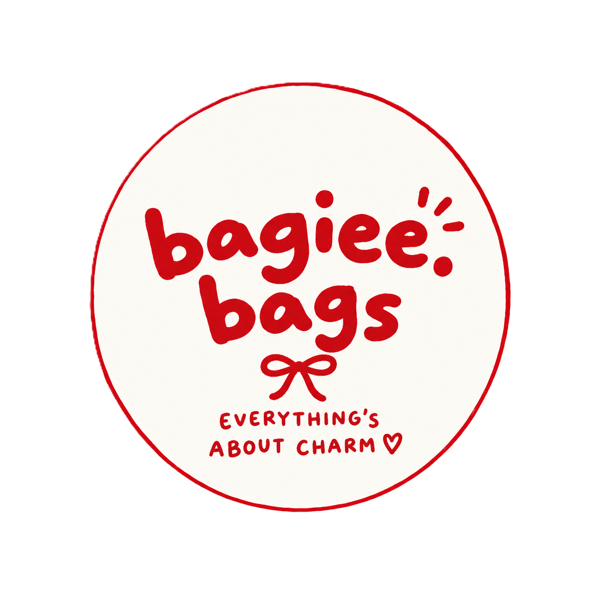

# Bagiee Bags — Prototype Storefront

<p align="center">
  
</p>

<p align="center">
  <strong>Bagiee Bags</strong> — playful bags, little charms, and pieces made to carry your story.
</p>

<p align="center">
  <a href="https://rakasyaa.github.io/Bagie-Bags/">Live Demo</a>
  &nbsp;•&nbsp;
  <a href="https://github.com/rakasyaa/Bagie-Bags">Repository</a>
</p>

---

## ✨ Overview

**Bagiee Bags** adalah prototype storefront untuk brand tas dan aksesori yang mengusung karakter **playful, personal, dan penuh warna**.

Website ini dikembangkan sebagai eksplorasi awal pengalaman digital Bagiee Bags sebelum diintegrasikan dengan sistem e-commerce, backend, pembayaran, dan manajemen produk secara penuh.

Prototype dibuat menggunakan **HTML, CSS, dan JavaScript vanilla** sehingga ringan, sederhana, responsif, dan dapat langsung di-deploy menggunakan GitHub Pages tanpa membutuhkan framework maupun backend.

### 🌐 Live Website

**https://rakasyaa.github.io/Bagie-Bags/**

---

## 🎨 Brand Direction

Visual website dirancang untuk mencerminkan karakter Bagiee Bags yang **warm, playful, expressive, dan approachable**.

Palet antarmuka menggunakan kombinasi:

- 🔴 Logo Red
- 🌸 Soft Pink
- 🥛 Warm Cream
- 🤍 Ivory
- 🤎 Dark Brown
- ❤️ Light Red

Pendekatan visual ini digunakan pada navigasi, hero section, product cards, buttons, typography, dan elemen pendukung lainnya agar identitas brand tetap konsisten di seluruh halaman.

---

## 🛍️ Product Preview

|                               What's in Our Charm                               |                                   Lipiee                                    |                                     Wiggie                                     |                                     Bloomie                                     |
| :-----------------------------------------------------------------------------: | :-------------------------------------------------------------------------: | :----------------------------------------------------------------------------: | :-----------------------------------------------------------------------------: |
|  |  |  |  |

Seluruh foto produk yang digunakan dalam prototype tersimpan secara lokal di folder [`assets/products`](./assets/products).

---

## 📄 Pages

| Page               | File                                           | Description                                                                                        |
| ------------------ | ---------------------------------------------- | -------------------------------------------------------------------------------------------------- |
| **Home**           | [`index.html`](./index.html)                   | Hero section, featured collection, product filtering, brand introduction, dan informasi pendukung. |
| **Products**       | [`products.html`](./products.html)             | Katalog seluruh produk yang tersedia dalam prototype.                                              |
| **Product Detail** | [`product-detail.html`](./product-detail.html) | Informasi detail produk berdasarkan item yang dipilih dari katalog.                                |
| **About Us**       | [`AboutUs.html`](./AboutUs.html)               | Cerita, nilai, dan identitas Bagiee Bags.                                                          |
| **Cart**           | [`keranjang.html`](./keranjang.html)           | Tampilan prototype untuk kondisi keranjang kosong.                                                 |
| **User Account**   | [`user.html`](./user.html)                     | Tampilan prototype untuk login dan pembuatan akun.                                                 |

---

## 🚀 Features

### Storefront

- Responsive homepage dengan hero section.
- Featured product collection.
- Product catalog dengan delapan produk.
- Product detail page yang dinamis.
- Product filtering berdasarkan koleksi:
  - All
  - New Arrivals
  - Best Sellers
  - Halloween Edit

- Product image preview menggunakan aset lokal.
- Navigasi antar halaman yang konsisten.

### User Interface

- Responsive layout untuk desktop, tablet, dan mobile.
- Responsive mobile navigation.
- Consistent header dan footer.
- Shopping cart interface.
- User account interface.
- Favicon dan brand assets.
- Cart icon dan account icon.
- WhatsApp contact link.
- Hover dan interaction states pada elemen UI.

### Dynamic Product Detail

Halaman detail produk dapat menampilkan produk berdasarkan parameter URL.

Contoh:

```text
product-detail.html?id=everyday-tote
```

Parameter tersebut digunakan oleh JavaScript untuk menentukan produk yang akan ditampilkan pada halaman detail.

---

## 🧩 Prototype Scope

Website ini merupakan **frontend prototype**, sehingga beberapa fitur masih bersifat simulasi.

| Feature           |    Status    |
| ----------------- | :----------: |
| Product Catalog   |      ✅      |
| Product Filtering |      ✅      |
| Product Detail    |      ✅      |
| Responsive Layout |      ✅      |
| Mobile Navigation |      ✅      |
| Shopping Cart UI  | 🟡 Prototype |
| User Account UI   | 🟡 Prototype |
| Authentication    |      ⏳      |
| Checkout          |      ⏳      |
| Payment           |      ⏳      |
| Order Management  |      ⏳      |
| Backend           |      ⏳      |
| Database          |      ⏳      |
| CMS / Admin Panel |      ⏳      |

> **Legend:**
> ✅ Implemented    🟡 Prototype / Visual Only    ⏳ Planned

---

## 🛠️ Tech Stack

### Frontend

- **HTML5** — Struktur halaman dan semantic markup.
- **CSS3** — Styling, layout, responsive design, dan visual system.
- **JavaScript (Vanilla)** — Interaksi, filtering, dynamic product detail, dan navigasi.

### Typography

- **Plus Jakarta Sans** — Primary typeface.
- **DM Mono** — Supporting / utility typeface.

### Deployment

- **GitHub Pages** — Hosting untuk prototype storefront.

Tidak menggunakan framework frontend, package manager, maupun backend sehingga project dapat dijalankan secara langsung melalui browser atau local development server.

---

## 📁 Project Structure

```text
Bagie-Bags/
│
├── index.html
├── products.html
├── product-detail.html
├── AboutUs.html
├── keranjang.html
├── user.html
│
├── assets/
│   ├── css/
│   │   └── style.css
│   │
│   ├── js/
│   │   └── script.js
│   │
│   ├── logo/
│   │
│   ├── icons/
│   │
│   ├── images/
│   │
│   └── products/
│
└── README.md
```

---

## 💻 Getting Started

### 1. Clone Repository

```bash
git clone https://github.com/rakasyaa/Bagie-Bags.git
```

### 2. Masuk ke Project

```bash
cd Bagie-Bags
```

### 3. Jalankan Project

Karena project menggunakan HTML, CSS, dan JavaScript vanilla, tidak diperlukan instalasi dependency.

Project dapat dijalankan menggunakan:

- **VS Code + Live Server**
- Local development server
- Browser secara langsung dengan membuka `index.html`

Untuk pengalaman development yang lebih baik, penggunaan **Live Server** disarankan agar path dan navigasi antar halaman berjalan secara konsisten.

---

## 🌐 Deployment

Prototype ini telah di-deploy menggunakan **GitHub Pages**.

### Live Demo

**https://rakasyaa.github.io/Bagie-Bags/**

### GitHub Repository

**https://github.com/rakasyaa/Bagie-Bags**

Untuk melakukan deployment ulang:

1. Push seluruh perubahan ke repository GitHub.
2. Buka repository pada GitHub.
3. Masuk ke **Settings**.
4. Pilih **Pages**.
5. Pada bagian **Build and deployment**, pilih **Deploy from a branch**.
6. Pilih branch utama, misalnya `main`.
7. Pilih folder `/(root)`.
8. Klik **Save**.
9. Tunggu proses deployment GitHub Pages selesai.

---

## 🔮 Future Development

Prototype ini dapat dikembangkan lebih lanjut menjadi storefront e-commerce dengan beberapa pengembangan berikut:

### Shopping Experience

- Menyimpan cart menggunakan `localStorage`.
- Menambahkan quantity control.
- Menambahkan wishlist.
- Menambahkan checkout flow.
- Menambahkan form alamat pengiriman.
- Menambahkan pilihan metode pembayaran.

### User Account

- Registrasi dan login pengguna.
- Profile management.
- Order history.
- Saved addresses.
- Wishlist.

### Backend & Data

- REST API / backend service.
- Database produk.
- Database pengguna.
- Database transaksi.
- Dynamic inventory.
- Product management.

### E-Commerce Management

- Admin dashboard.
- Product CRUD.
- Stock management.
- Order management.
- Customer management.
- Sales reporting.

### Content Management

- CMS untuk produk dan artikel.
- Dynamic product categories.
- Promotional banners.
- Campaign / seasonal collections.

---

## 📌 Project Status

**Current Status: Prototype / Frontend Development**

Bagiee Bags saat ini difokuskan pada pengembangan **visual identity, storefront experience, responsive interface, dan product browsing experience**.

Fitur transaksi dan manajemen data belum terhubung dengan backend sehingga website belum ditujukan untuk transaksi e-commerce secara nyata.

---

## 👤 Project

**Bagiee Bags**

> Everything About Charm.

Designed and developed as a storefront prototype for exploring the digital shopping experience of Bagiee Bags.

---

<p align="center">
  © 2026 Bagiee Bags — Everything About Charm.
</p>
